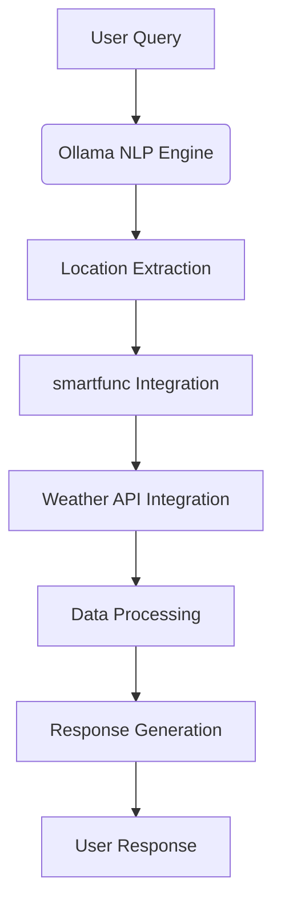

# 🌤️ Weather AI Agent

[](https://python.org/) [](https://claude.ai/chat/LICENSE) 

> An intelligent conversational weather assistant powered by advanced AI models and real-time meteorological data

Welcome to the **Weather AI Agent**, a sophisticated Python-based application that delivers real-time weather information through an intuitive conversational interface. Powered by the cutting-edge **Ollama** language model for natural language processing and the **smartfunc** library for robust backend functionality, this project aims to provide accurate and user-friendly weather updates for any location worldwide. Whether you're a developer, a weather enthusiast, or simply curious about the forecast, the Weather AI Agent is designed to make accessing weather data seamless and engaging.

## 🚀 Key Features

- **Natural Language Understanding**: Ask about weather conditions just like you'd ask a human expert
- **Global Coverage**: Get weather data for any location worldwide
- **Multi-source Data**: Combines satellite imagery, weather station data, and atmospheric models
- **Intelligent Forecasting**: AI-enhanced predictions beyond standard weather models
- **Conversational Interface**: Interactive dialogue for follow-up questions and clarifications
- **Extensible Architecture**: Easily integrate with other systems and data sources
- **Privacy Focused**: Local processing option keeps your location data private

## 🏗️ Architecture

The Weather AI Agent follows a modular architecture designed for scalability and maintainability:

```
Weather AI Agent
├── Core Engine (Ollama Integration)
├── Weather Data Layer (smartfunc)
├── Natural Language Processor
├── Location Services
├── Data Aggregation Layer
└── User Interface
```

#### Technical Architecture


### Technology Stack

- **AI/ML Framework**: Ollama (LLama3.2, Gemma3.2, and other compatible models)
- **Backend Processing**: smartfunc library
- **Data Processing**: Python 3.11+ with asyncio support
- **Weather APIs**: Multiple satellite and meteorological data sources
- **Configuration**: Environment-based configuration management

## 📋 Prerequisites

Before installing the Weather AI Agent, ensure your system meets the following requirements:

### System Requirements

- **Operating System**: Windows 10+, macOS 10.14+, or Linux (Ubuntu 18.04+)
- **Python**: Version 3.11 or higher
- **Memory**: Minimum 4GB RAM (8GB recommended for optimal performance)
- **Storage**: At least 2GB free disk space
- **Network**: Stable internet connection for real-time weather data

### Software Dependencies

- **Ollama**: Must be installed and configured on your system
- **Package Manager**: pip or poetry for dependency management
- **Environment Manager**: python-dotenv for configuration

### API Access

- Internet connection for accessing weather data APIs
- Optional: API keys for premium weather services (configured via environment variables)

## Setup

To configure the Weather AI Agent, follow these steps:

1. **Create a `.env` File**:
   In the project root directory, create a file named `.env` with the following content:
   ```
   MODEL=llama3.2
   ```
   - Replace `llama3.2` with your preferred Ollama model (e.g., `gemma3.2`).
   - If your weather data source requires an API key, replace `your_weather_api_key` with the key obtained from the provider (see [Data Source](#data-source)).

2. **Verify Ollama Configuration**:
   Ensure the Ollama model specified in the `.env` file is installed. You can check available models by running:
   ```bash
   ollama list
   ```
   To install a model (e.g., LLama3.2):
   ```bash
   ollama pull llama3.2
   ```

3. **Optional: Configure Weather API**:
   If you’re using a specific weather API (e.g., OpenWeatherMap, AccuWeather), ensure the API key is valid and the service is accessible. Refer to the provider’s documentation for setup instructions.

## Installation

### Method 1: Quick Setup (Recommended)

1. **Clone the Repository**
    ```bash
    git clone https://github.com/mmycin/weather-ai-agent.git
    cd weather-ai-agent
    ```
2. **Create Virtual Environment**
    ```bash
    python -m venv venv
    
    # On Windows
    venv\Scripts\activate
       
    # On macOS/Linux
    source venv/bin/activate
    ```
3. **Install Dependencies**
    ```bash
    pip install -r requirements.txt
    ```

### Method 2: Using `poetry` (Advanced)

1. **Install Poetry** (if not already installed)
    ```bash
    curl -sSL https://install.python-poetry.org | python3 -
    ```
2. **Install Project Dependencies**
    ```bash
    poetry install
    poetry shell
    ```

### Method 3: Using `uv`

`uv` is a **Rust** based package manager which is considered to be extremely fast and reliable for package management and replacement for pip. It's like the `npm` of Python.
### Method 2: Using `poetry` (Advanced)

1. **Install uv** 
    ```bash
    curl -LsSf https://astral.sh/uv/install.sh | sh
    #or,
    pip install uv
    ```
2. **Install Project Dependencies**
    ```bash
    uv lock
    ```

### Method 3: Development Setup

1. **Clone with Development Dependencies**
    ```bash
    git clone https://github.com/mmycin/weather-ai-agent.gitcd weather-ai-agentpip install -e ".[dev]"
    ```

### Supported Models

The agent supports various Ollama models:

| Model       | Size | Performance | Recommended Use                     |
| ----------- | ---- | ----------- | ----------------------------------- |
| llama3.2    | ~4GB | High        | General purpose (default)           |
| gemma3.2    | ~2GB | Medium      | Resource-constrained environments   |
| mistral     | ~4GB | High        | Advanced conversational features    |
| deepseek-r1 | ~5GB | Very High   | Deep thinking and logistic analysis |


## Running the Application

To start the Weather AI Agent, execute the following command in the project root directory:

```bash
# Run the model first
ollama run MODEL_NAME

python main.py
```

Or if you're using `uv`:
```bash
uv run main.py
```

The application will initialize the Ollama model and connect to the weather data source. Once running, you can interact with the agent through the command line or a designated interface (if implemented).

## Compiling to Binary

If you want to compile the project to a binary executable file, you can use the **PyInstaller** library that has already been installed with the project. To use it as an executable file first create a file called `setup.py`. For instance, it has already been included in the project. But it is based on `uv` not `pip`. So to make it compatible for pip, just change the file as:

```diff
import os

- os.system("uv run main.py")
+ os.system("pip run main.py)

# Use pip3, pypy, pipx or any package manager of your choice
```

Now run this command:
```bash
pyinstaller --onefile --name weatherai setup.py 
```

It will generate an executable file named `weatherai` or `weatherai.exe` depending on your system. To use it now, just run:
```bash
./weatherai
```

You can also  add the command to your environment path in the `.bashrc` or `zshrc` file depending on your shell. 

## Usage

The Weather AI Agent accepts natural language inputs related to weather queries. Examples of valid prompts include:
#### Basic Weather Information

- "What's the weather like in Miami?"
- "Current temperature in Stockholm"
- "Is it raining in Vancouver right now?"

#### Forecast Queries

- "Will it be sunny tomorrow in Barcelona?"
- "Weekend weather forecast for Denver"
- "Next week's weather in Mumbai"

#### Comparative Queries

- "Is it warmer in Dubai or Cairo today?"
- "Compare the weather in New York and Los Angeles"

#### Activity-Based Queries

- "Is it good weather for hiking in the mountains?"
- "Should I bring an umbrella to work tomorrow?"
- "Is it beach weather in San Diego?"

#### Specific Conditions

- "What's the humidity level in Singapore?"
- "How strong are the winds in Chicago?"
- "What's the UV index in Phoenix today?"

The agent processes these queries using the Ollama model and retrieves relevant weather data from satellite sources. Responses are concise, accurate, and formatted for easy understanding.

### Example Interaction
```plaintext
You: What's the weather like in Tokyo?
AI: Currently in Tokyo, Japan, it's 22°C with partly cloudy skies. 
       There's a gentle breeze at 15 km/h from the northeast, and 
       humidity is at 68%. Perfect weather for a walk!

You: Will it rain tomorrow?
AI: Tomorrow in Tokyo, there's a 30% chance of light rain in the 
       afternoon. Morning will be mostly sunny with temperatures 
       reaching 24°C. I'd recommend carrying a light umbrella just in case.

You: How about the weekend forecast?
AI: This weekend in Tokyo looks great! Saturday will be sunny with 
       highs of 26°C, and Sunday will be partly cloudy with 23°C. 
       Perfect weather for outdoor activities!

```

To exit the application, press `Ctrl+C` or say any kind of conversation ending text like goodbye, exit, quit, that's all etc. Although it will depend on your AI model if it can pull out the command. But for all cases, 'bye' in your sentence will quit the interface.

## Data Source

The Weather AI Agent retrieves weather data from satellite-based meteorological services, ensuring high accuracy and global coverage. By default, the application integrates with a weather API (e.g., OpenWeatherMap, MeteoSat, or similar). These APIs leverage data from:

- **Geostationary Satellites**: Provide real-time imagery and atmospheric data for weather forecasting.
- **Ground-Based Observations**: Complement satellite data with local measurements for enhanced accuracy.
- **Numerical Weather Prediction Models**: Process raw data to generate reliable forecasts.

To use a specific weather API, obtain an API key from the provider and add it to the `.env` file (see [Setup](#setup)). Popular weather APIs include:

- **OpenWeatherMap**: [https://openweathermap.org/api](https://openweathermap.org/api)
- **AccuWeather**: [https://developer.accuweather.com/](https://developer.accuweather.com/)
- **MeteoSat**: [https://www.eumetsat.int/](https://www.eumetsat.int/)

Ensure the chosen API supports the required data (e.g., current conditions, forecasts, historical data) and is compatible with the `smartfunc` library.

### Data Processing Pipeline

1. **Data Ingestion**: Real-time collection from multiple APIs
2. **Quality Control**: Automated data validation and error detection
3. **Data Fusion**: Intelligent combination of multiple sources
4. **Interpolation**: Gap filling using machine learning algorithms
5. **Caching**: Smart caching for improved response times
### Update Frequencies

- **Current Conditions**: Every 5-15 minutes
- **Hourly Forecasts**: Updated every hour
- **Daily Forecasts**: Updated twice daily

# Advanced Usage
### Integration with Other Applications

```python
from weather_agent.lib import analyze

response = analyze("Will I need an umbrella this weekend?")
print(response)
```

### Creating Custom Functions

Extend functionality by adding to ai.py`:
```python
@ai
def get_weather_alerts(location: str):
    """
    Fetches severe weather alerts for specified location {{ location }}
    Returns: Dictionary of alert types and descriptions
    """
    ...
```

### Response Format

```json
{
  "location": {
    "name": "Tokyo, Japan",
    "coordinates": [35.6762, 139.6503],
    "timezone": "Asia/Tokyo"
  },
  "current": {
    "temperature": 22.5,
    "feels_like": 24.1,
    "humidity": 68,
    "pressure": 1013.25,
    "visibility": 10,
    "uv_index": 6,
    "conditions": "Partly Cloudy",
    "wind": {
      "speed": 15,
      "direction": "NE",
      "gust": 22
    }
  },
  "forecast": [...],
  "alerts": [...],
  "last_updated": "2024-03-15T14:30:00Z"
}
```

Troubleshooting

### Common Issues and Solutions

#### Issue: "Ollama model not found"

**Solution:**

```bash
# Check available models
ollama list

# Install the required model
ollama pull llama3.2

# Verify installation
ollama run llama3.2 "Hello"
```

#### Issue: "Location not found"

**Solutions:**
- Use more specific location names (e.g., "Paris, France" instead of "Paris")
- Include country codes for international locations
- Use coordinates for precise locations
- Check spelling of location names

#### Issue: "Slow response times"

**Optimizations:**
- Use a smaller AI model for faster processing
- Optimize network connection
- Consider running Ollama locally

#### Issue: "Memory errors with large models"

**Solutions:**

```bash
# Use a smaller model
MODEL=gemma3.2

# Increase system swap space (Linux/macOS)
sudo fallocate -l 4G /swapfile
sudo mkswap /swapfile
sudo swapon /swapfile

# Monitor memory usage
python main.py --monitor-memory
```

### Debugging Mode

Enable detailed logging:

```bash
# Enable debug mode
python main.py --debug

# View logs
tail -f weather_agent.log

# Specific log levels
export LOG_LEVEL=DEBUG
python main.py
```

### Performance Monitoring

```bash
# Check system resources
python -c "
import psutil
print(f'CPU: {psutil.cpu_percent()}%')
print(f'Memory: {psutil.virtual_memory().percent}%')
print(f'Disk: {psutil.disk_usage(\"/\").percent}%')
"

# Monitor API response times
python main.py --benchmark
```

## ❓ Frequently Asked Questions

### General Questions

**Q: What makes this different from other weather apps?** A: Unlike traditional weather apps, the Weather AI Agent understands natural language and provides conversational responses. You can ask complex questions like "Should I plan a picnic this weekend?" and get contextual advice based on weather conditions.

**Q: Does it work offline?** A: The AI processing can work offline if you have Ollama running locally, but weather data requires an internet connection. We're working on offline caching for basic functionality.

**Q: How accurate is the weather data?** A: We aggregate data from multiple professional meteorological sources including satellite data, ensuring high accuracy. Forecast accuracy typically ranges from 90% (next day) to 70% (7 days out).

### Technical Questions

**Q: Can I customize the AI model?** A: Yes! The agent supports various Ollama models. You can switch between them based on your performance and accuracy needs.

**Q: How do I add new weather data sources?** A: The architecture is modular. You can extend the `DataSource` class and register new providers in the configuration.

**Q: Is there an API I can use in my own applications?** A: Yes, run the agent in API mode using `python main.py --api-mode` for REST API access.

**Q: How often is the weather data updated?** A: Current conditions update every 5-15 minutes, hourly forecasts every hour, and extended forecasts twice daily.

### Deployment Questions

**Q: Can I deploy this on a server?** A: Absolutely! The agent works great in server environments. See our deployment guide for Docker and cloud platform instructions.

**Q: What are the system requirements for production?** A: For production use, we recommend at least 8GB RAM, 4 CPU cores, and a stable internet connection. GPU acceleration is optional but recommended for large models.

**Q: How do I handle high traffic?** A: Implement caching, use load balancing, and consider running multiple instances. The agent is designed to be horizontally scalable.

### Data and Privacy

**Q: Do you store user queries?** A: By default, we only log errors for debugging. You can configure logging levels in the `.env` file. No personal data is transmitted to external services without explicit configuration.

**Q: Which weather APIs do you support?** A: We support multiple APIs including OpenWeatherMap, WeatherAPI, and NOAA. You can configure your preferred sources in the environment settings.

**Q: Is my location data private?** A: Yes, location queries are processed locally and only coordinates are sent to weather APIs when necessary. No location history is stored by default.

Contributing

We welcome contributions from the community! Here's how you can help improve the Weather AI Agent:

### Getting Started

1. **Fork the Repository**
    ```bash
    git clone https://github.com/mmycin/weather-ai-agent.git
    cd weather-ai-agent
    git checkout -b feature/your-feature-name
    ```
2. **Set Up Development Environment**
    ```bash
    pip install -e ".[dev]"
    pre-commit install
    ```
3. **Run Tests**
    ```bash
    pytest tests/
    python -m pytest 
    ```

### Types of Contributions

#### 🐛 Bug Reports

- Use our issue template
- Include steps to reproduce
- Provide system information
- Add relevant logs

#### 💡 Feature Requests

- Describe the use case
- Explain the expected behavior
- Consider backward compatibility
- Propose implementation approach

#### 📝 Documentation

- Fix typos and grammar
- Add examples and tutorials
- Improve API documentation
- Create video tutorials

#### 🔧 Code Contributions

- Follow PEP 8 style guidelines
- Write comprehensive tests
- Update documentation
- Add type hints

### Development Guidelines

#### Code Style

```bash
# Format code
black weather_agent/
isort weather_agent/

# Lint code
pylint weather_agent/
mypy weather_agent/
```

#### Testing

```bash
# Run all tests
pytest

# Run with coverage
pytest --cov=weather_agent --cov-report=html

# Run specific test categories
pytest -m unit
pytest -m integration
```

#### Documentation

```bash
# Build documentation
cd docs/
make html

# Serve documentation locally
python -m http.server 8000 -d docs/_build/html
```

### Pull Request Process

1. **Create Feature Branch**
2. **Make Changes** with proper tests
3. **Update Documentation** as needed
4. **Run Tests** and ensure they pass
5. **Submit Pull Request** with detailed description
6. **Address Review Comments**
7. **Celebrate** when merged! 🎉

### Code of Conduct

We are committed to providing a welcoming and inclusive environment. Please read our [Code of Conduct](https://claude.ai/chat/CODE_OF_CONDUCT.md) before contributing.

Roadmap

### Current Version (v1.0)

- ✅ Basic weather queries
- ✅ Multiple AI model support
- ✅ Real-time data integration
- ✅ Natural language processing

### Upcoming Features (v1.1)

- 🔄 **Enhanced Forecasting**: 14-day extended forecasts
- 🌍 **Multi-language Support**: Queries and responses in multiple languages
- 📊 **Weather Analytics**: Historical trends and climate analysis
- 🔔 **Smart Notifications**: Proactive weather alerts
- 📱 **Mobile App**: Native iOS and Android applications

### Medium-term Goals (v2.0)

- 🤖 **Advanced AI Features**: Predictive analytics and personalized recommendations
- 🛰️ **Satellite Integration**: Direct satellite data processing
- 🌐 **Global Expansion**: Enhanced coverage for remote locations
- 🔌 **Plugin System**: Third-party integrations and extensions
- ☁️ **Cloud Deployment**: One-click cloud deployment options

### Long-term Vision (v3.0+)

- 🧠 **Machine Learning**: Custom weather prediction models
- 🏠 **IoT Integration**: Smart home and sensor network integration
- 🌪️ **Extreme Weather**: Advanced severe weather prediction
- 🌱 **Climate Insights**: Climate change impact analysis
- 🤝 **Community Features**: User-generated content and sharing

### Community Wishlist

Vote on features you'd like to see:

- [ ] Voice interaction capabilities
- [ ] Augmented reality weather visualization
- [ ] Agricultural weather advisories
- [ ] Marine and aviation weather
- [ ] Air quality integration
- [ ] Pollen and allergy forecasts

## License

This project is licensed under the MIT License - see the [LICENSE](https://claude.ai/chat/LICENSE) file for details.

### Third-Party Licenses

This project includes components under various licenses:

- **Ollama**: Apache License 2.0
- **smartfunc**: MIT License
- **Python Libraries**: Various (see requirements.txt)

## Contact

For questions, suggestions, or feedback, reach out to the project maintainers:

- **GitHub**: [https://github.com/mmycin/weather-ai-agent](https://github.com/mmycin/weather-ai-agent)
- **Email**: mycin.mit@gmail.com
- **Community**: Join our Discord or forum (if available) for real-time discussions.

We hope you enjoy using the Weather AI Agent! Stay informed about the weather, and happy coding! 🌦️